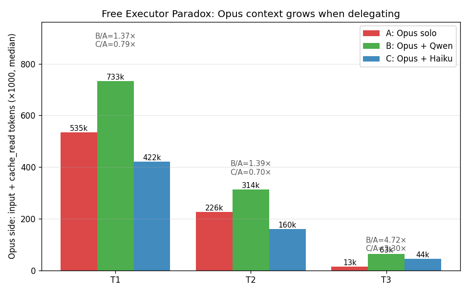

# The Free-Executor Paradox

<!-- DOI badge goes here after Zenodo upload:
[](https://doi.org/10.5281/zenodo.XXXXXXX)
-->

Empirical comparison of four LLM configurations on Python code-repair tasks under a deterministic correctness judge (mypy + ruff + pytest). Paper accompanying the experiment: [paper/main.pdf](paper/main.pdf).



## TL;DR

The canonical recipe for cost-aware agentic coding — _"use a strong model to orchestrate, a cheap model to execute"_ — fails on every iterative code-repair task we measured.

When the executor is **free** at the token meter (locally hosted Qwen 3.5-9B), the orchestrator's prompt-cached re-reads of the executor's returned summaries grow its own input volume by **1.4–5.3×** over running Opus alone. The structure ends up being the most expensive cloud configuration we tested, not the cheapest.

| arm | T1 (breakage) | T2 (refactor) | T3 (feature-add) |
|-----|--------------:|--------------:|----------------:|
| A Opus solo     | $1.74 | $1.11 | **$0.17** (cloud-best) |
| B Opus + Qwen   | $2.27 | $1.38 | $0.42 |
| C Opus + Haiku  | $1.67 (cloud-best) | $0.92 (cloud-best) | $0.38 |
| D Haiku solo    | **$0.30** | **$0.23** | **$0.08** (overall-best, 25% fail rate on T1/T2) |

Success-only medians, $n = 3$ per cell, 40 trials total.

## Key Findings

1. **Task type rotates the Pareto frontier.** Opus solo dominates T3 (small feature-add); Haiku solo dominates T1 (long breakage recovery) on dollar cost.
2. **The free-executor paradox.** Arm B (Opus + free local Qwen) is the most expensive cloud arm on every task. The orchestrator's cache reads dominate any savings from delegating execution.
3. **Cost-reliability tradeoff.** Haiku solo's 5.5× cost advantage on T1 is bought at a 25% failure rate within our per-arm iteration cap. Expected cost under retry narrows the gap to 4.2×.
4. **Within the cloud, Opus + Haiku is the most balanced.** Beats Opus solo on T2 cost, ties on T1, and only loses to Opus solo on the smallest task.

## Methodology

- **Configurations.** Four arms: Opus 4.7 solo, Opus orchestrating Qwen 3.5-9B (free), Opus orchestrating Haiku 4.5, Haiku 4.5 solo. Identical tool surfaces; orchestrators add a `delegate_to_executor` tool.
- **Tasks** (all on [typer](https://github.com/tiangolo/typer) at tag `0.26.8`, commit `b210c0e`):
  - **T1 — Breakage recovery.** 25 errors (10 mypy + 10 ruff + 5 pytest collection failures) injected via AST.
  - **T2 — Refactor.** Move `get_params_from_function` to a new module, update every import site.
  - **T3 — Feature-add.** Implement `get_version_banner` and pass a SHA-256-fingerprinted test.
- **Judge.** `mypy + ruff check + pytest` exit code. No LLM grades the work.
- **Statistics.** Median + 95% bootstrap CI per cell, pairwise Mann-Whitney U (cost) per task, Cliff's delta for effect size.

## Repository Structure

```
free-executor-paradox/
├── README.md                          this file
├── LICENSE                            MIT
├── paper/
│   ├── main.tex / main.pdf            paper source + 12-page PDF
│   ├── references.bib
│   ├── paper.md                       Markdown mirror (optional read)
│   └── zenodo-metadata.json
├── scripts/
│   ├── harness.sh                     uv run mypy + ruff + pytest, JSON output
│   ├── runners/
│   │   ├── runner.py                  CLI: --arm A|B|C|D --task T1|T2|T3 --trial N
│   │   ├── agent.py                   Anthropic SDK tool-loop (solo + orchestrated)
│   │   ├── tools.py                   str_replace_editor + bash
│   │   ├── task_prompts.py            SYSTEM_SOLO / ORCHESTRATOR / EXECUTOR + task descriptions
│   │   ├── costs.py                   Anthropic + Qwen rate-card
│   │   ├── harness_io.py              harness.sh / verify-T*.sh wrappers
│   │   └── batch.sh                   sequential n-trial runner (fail-tolerant)
│   ├── breakage-pack/
│   │   ├── inject-breakage.py         T1 AST injection (25 errors)
│   │   ├── reset.sh                   git checkout + clean caches
│   │   ├── inject-T3.sh / verify-T2.sh / verify-T3.sh
│   │   └── T1/T2/T3 specs
│   └── analysis/
│       ├── analyze.py                 summary table + bootstrap CI + Cliff's delta + Pareto + token-growth plots
│       └── export_csv.py              jsonl → trials.csv
├── data/
│   ├── results/
│   │   ├── A.jsonl B.jsonl C.jsonl D.jsonl    raw trial outputs
│   └── trials.csv                     flattened
└── results/
    └── figures/
        ├── pareto-T1.png pareto-T2.png pareto-T3.png
        └── token-growth.png
```

## Reproducibility

Tested on Ubuntu 22.04 with Python 3.10+, `uv` 0.4+, and `anthropic` Python SDK 0.83+. The Qwen executor uses Ollama 0.4+ on a Tailscale-reachable host running model `qwen3.5:9b`.

```bash
# 1. Clone this repo
git clone https://github.com/kenimo49/free-executor-paradox
cd free-executor-paradox

# 2. Clone base repo (typer at 0.26.8, commit b210c0e)
git clone --depth 1 --branch 0.26.8 \
    https://github.com/tiangolo/typer base-repo/typer
(cd base-repo/typer && uv sync)

# 3. Confirm green base on the harness
scripts/harness.sh --json-only   # expect exit_code=0, 1356 passed

# 4. Provide ANTHROPIC_API_KEY (env or .env)
export ANTHROPIC_API_KEY=sk-ant-...

# 5. (Optional) point at Ollama host for arm B
export OLLAMA_HOST=http://<tailscale-host>:11434

# 6. Run a single trial end-to-end (cd scripts/ for module resolution)
cd scripts && python -m runners.runner --arm A --task T3 --trial 0

# 7. Full re-run targeting n=3 successes/cell
scripts/runners/batch.sh all 3

# 8. Regenerate tables + Pareto plots
python3 scripts/analysis/analyze.py --plot
python3 scripts/analysis/export_csv.py
```

For arm B specifically: if Ollama / Tailscale are unavailable, arm B trials will time out at the delegate-tool boundary; arms A, C, D remain runnable.

Total Anthropic spend for the 40 trials in this dataset: **\$35.98**.

## Citation

```bibtex
@misc{imoto2026paradox,
  title  = {When Free Executors Cost More: The Free-Executor Paradox in Iterative LLM Code-Repair Loops},
  author = {Imoto, Ken},
  year   = {2026},
  doi    = {<TBD after Zenodo upload>},
  url    = {https://github.com/kenimo49/free-executor-paradox}
}
```

## Related Work

- Ong et al. (2024). [RouteLLM](https://arxiv.org/abs/2406.18665). Query-level routing.
- Chen et al. (2023). [FrugalGPT](https://arxiv.org/abs/2305.05176). Cost cascade.
- Wang et al. (2024). [Mixture-of-Agents](https://arxiv.org/abs/2406.04692). LLM-judge synthesis.
- Jimenez et al. (2024). [SWE-bench](https://arxiv.org/abs/2310.06770). Real-world repository tests.

## Author

Ken Imoto ([@kenimo49](https://github.com/kenimo49)), Propel-Lab LLC.
[https://kenimoto.dev](https://kenimoto.dev) · [imoto@propel-lab.co.jp](mailto:imoto@propel-lab.co.jp)

## License

Code: MIT. Paper text and figures: CC-BY 4.0.
